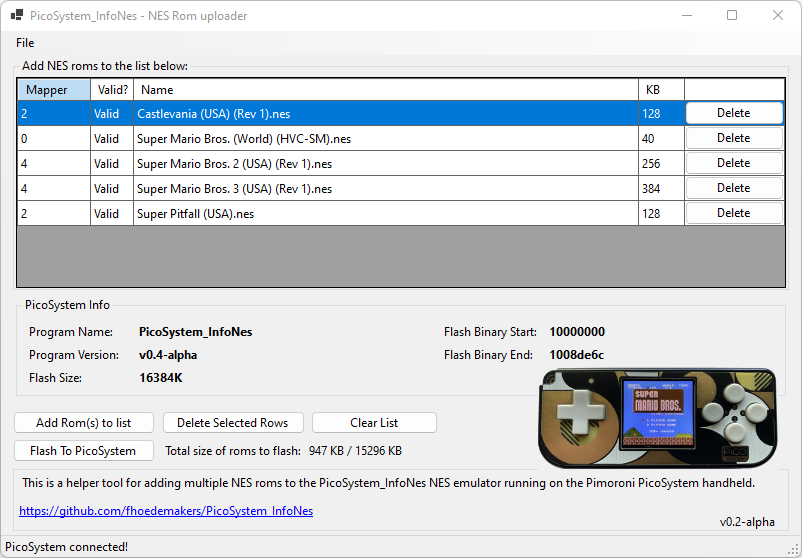

# PicoSystemInfoNesLoader
## What is it.
A Windows companion app for the [PicoSystem_InfNes NES emulator](https://github.com/fhoedemakers/PicoSystem_InfoNes), running on a [Pimoroni PicoSystem](https://shop.pimoroni.com/products/picosystem).

Because there is no SD card available, this application lets the user choose NES roms from the local file system and flash them to the PicoSystem.

It is also possible to flash a new version of the Emulator to the PicoSystem.

The application is tested in Windows 11 x64. The application should also work on a 32 and 64 bit versions of Windows 10. 

## Where to buy the PicoSystem

- UK: [https://shop.pimoroni.com/products/picosystem?variant=32369546985555](https://shop.pimoroni.com/products/picosystem?variant=32369546985555)
- EU: [https://www.kiwi-electronics.com/en/picosystem-10913?search=picosystem](https://www.kiwi-electronics.com/en/picosystem-10913?search=picosystem)
- US: [https://www.adafruit.com/product/5289](https://www.adafruit.com/product/5289)

## Install
Download and extract the zipfile **PicoSystemInfoNesLoader.zip** found on the bottom page the [latest release](https://github.com/fhoedemakers/PicoSystemInfoNesLoader/releases/tag/latest) to a folder of choice, then start **PicoSystemInfoNesLoader.exe** in subfolder **PicoSystemInfoNesLoader**. It can take a minute before the application starts.

When you see the screen below: 

click on **More Info**, then **Run Anyway**

## Driver installation

In order for the app to communicate with the PicoSystem an USB driver is needed. The app can detect whether the driver needs to be installed. The driver then can be installed from within the application. Installation can take some time.

